# SHACL Form Editor - Getting Started

The SHACL Form Editor helps you create SHACL shapes using a visual editor. You are expected to understand what SHACL is, what constraints do, and have a basic understanding of RDF.

Make sure the editor is running (web, standalone, or development mode). See [README.md](../README.md) for how to start the application.

## Creating a file

When you first open the editor, the **Files** view is empty. Use the **New File** button to create your first SHACL file.

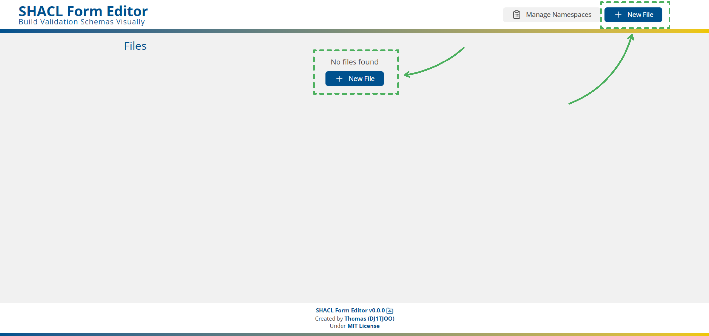

This opens a dialog where you provide the file name

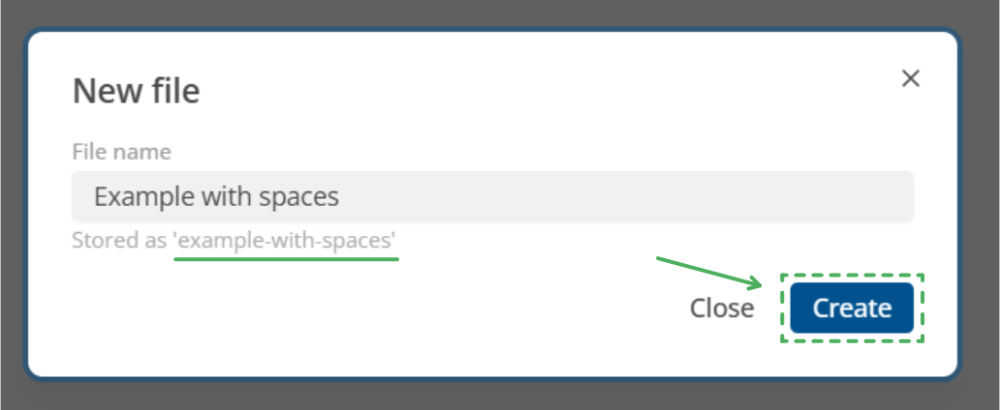

1. **File name**: Enter a human-friendly name such as `Example with spaces`.
2. **Stored as**: The editor shows how the file will be stored internally (e.g. `example-with-spaces`).
3. Click **Create** to create and open the file.

## Choosing namespaces

Each file uses a set of active namespaces. These determine the prefixes you can use for shapes and properties.

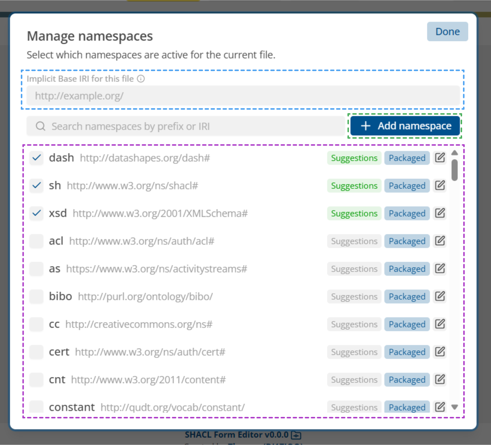

1. (Blue) The Implicit Base IRI can be used for a local namespace (allows for `:LocalClass`). Make sure the IRI is full ending with either a `/` or `#`
2. (Purple) List of known namespaces that can be activated, or edited. When **suggestions** is green autocomplete for this namespace is activated
3. (Green) Add a new namespace, see below.

### Add namespace

If a required namespace is missing, you can add it using **Add namespace** in the manager

1. **Prefix**: Short name you will use in paths (for example `ex`).
2. **IRI**: The full namespace IRI, e.g. `http://example.org/`. Make sure it ends with either a `/` or `#`.
3. **Fetch URL / Content Type**: Optional metadata, useful when namespaces are retrievable for autocomplete.
4. Click **Save** to add the namespace to the list and make it available in the editor.

## Prefix inputs

SHACL and RDF make use of IRI's a lot, to make this easier there are prefixes set in the namespace manager. There prefixes can be used in the prefix inputs (e.g.: `path`, `targetNode`, `datatype`, etc)

The prefix input has two feature:

1. Auto-complete: when typing in a prefix or localName (e.g. `person`) it will show a list of suggestions to choose from

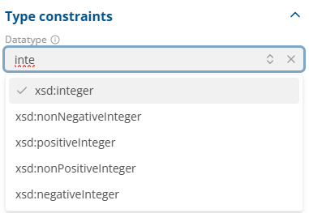

2. It will shorten full IRI (e.g. `http://example.org/Test` -> `ex:Test`) when the namespace is known and **activated**

3. It will keep full IRI for unknown namespaces

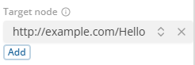

# Creating first shape

With a file open and namespaces configured, lets create your first shape.

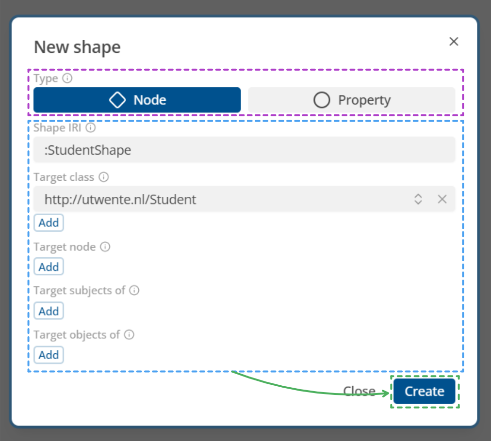

1. (Purple) **Type**: Choose **Node** (for a node shape) or **Property** (for a standalone property shape).
2. (Blue) **Shape IRI**: The identifier of the shape, e.g. `:StudentShape` or a full path `http://example.org/StudentShape`.
3. (Blue) **Target class / node / subjects / objects**: Configure what this shape applies to (e.g. a `Student` class).
4. (Green) Click **Create** to add the shape and open it in the visual editor.

# Overview

Once a file and shape are created, the **Editor** mode shows the main layout of the visual editor:

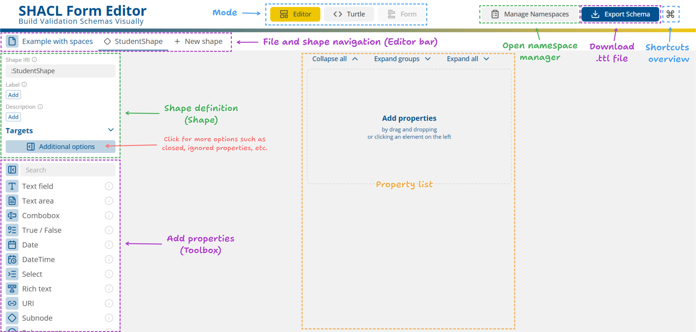

- (Blue) **Mode selector**: Switch between **Editor**, **Turtle**, and **Form** modes. **Important!**: The Form mode is currently not implemented!
- (Purple) **File and shape navigation (editor bar)**: Tabs for the current file, current shape, and a **New shape** button.
- (Green) **Shape definition panel (left)**: Configure the selected shape (IRI, label, description, targets, additional options).
- (Purple) **Toolbox (left)**: Drag elements such as **Text field**, **True / False**, **URI**, etc. to create properties.
- (Orange) **Property list (center)**: Shows all properties in the current shape; this is where you drop elements from the toolbox.
- **Top‑right actions**: Open the namespace manager, export the schema as `.ttl`, and open the shortcuts overview.

## Rename file

You can rename or delete the current file by left clicking it in the editor bar. It also allows you to quickly create another file or return to the file list.

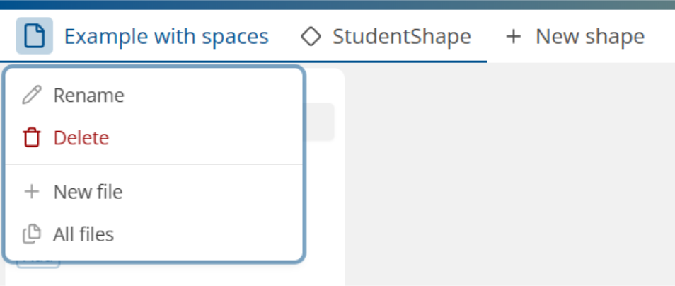

## Remove shape

To remove a shape right click on the shape in the editor bar.

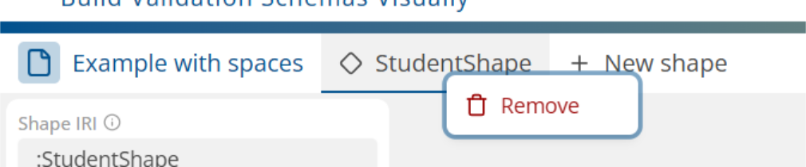

# Properties

To create a property (such as **Text field**) drag it from the toolbox on the left into the property list, or click to add it.

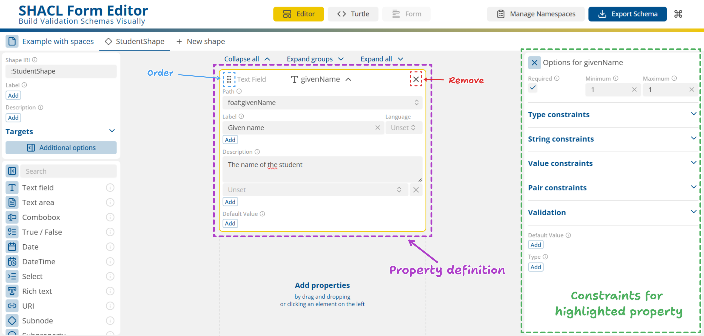

- (Purple) **Property card**: Configure path (e.g. `foaf:givenName`), label, description, and other display options.
- (Blue) **Order**: Use the handle at the top‑left to reorder properties
- (Red) **Remove**: the **X** button to remove a property.
- (Green) **Options**: Configure constraints for the highlighted property.

# Grouping

You can group related properties.

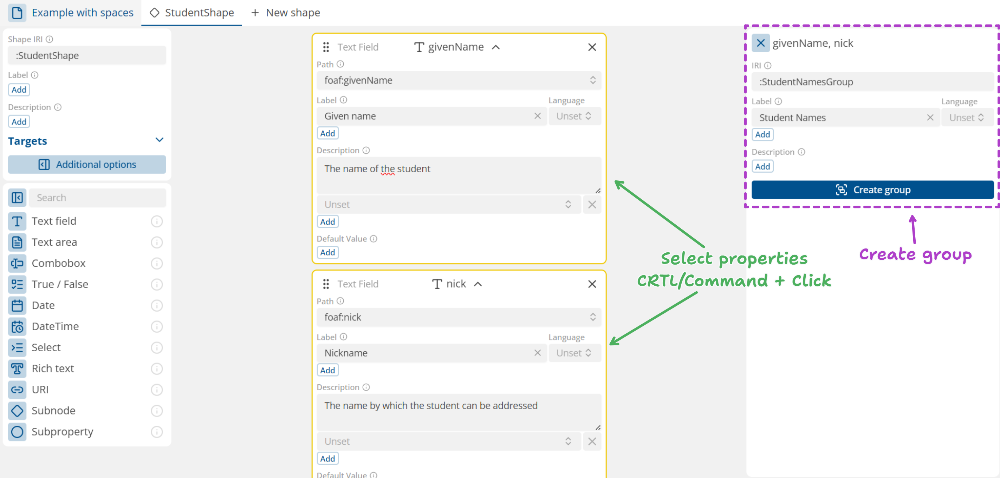

1. (Green) **Select properties**: Use Ctrl/Command + click to select multiple properties in the property list.
2. (Purple) **Create group**: With multiple properties selected, use the **Create group** action on the right to create a new group shape (e.g. `StudentNamesGroup`). An IRI and name are required.

Once a group has been created, it appears as a single grouped block that can be ordered like any other property:

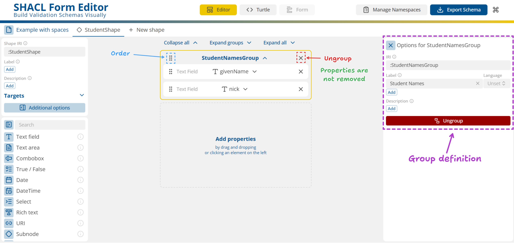

- (Purple) **Options**: Configure group IRI, labels and descriptions.
- (Blue) **Order**: Use the handle at the top‑left to reorder group or properties
- (Red) **Remove/Ungroup**: the **X** button to ungroup a group, the underlying properties stay in the shape.

# Direct editing (Turtle)

For advanced users, the editor offers a **Turtle** mode where you can directly edit the SHACL/Turtle source.

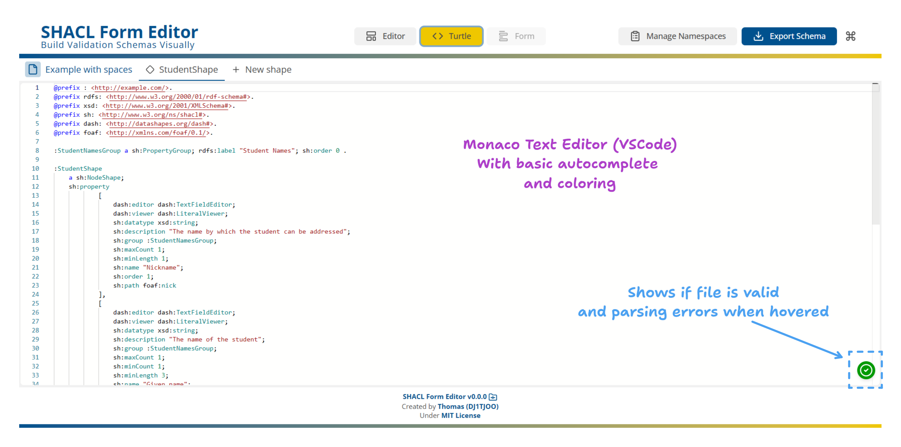

- **Monaco text editor**: A code editor (used in VS Code) with syntax coloring and basic autocomplete.
- **Status indicator (bottom‑right)**: Shows whether the file parses correctly and reveals parsing errors when hovered.
- Any valid changes you make in Turtle mode are reflected back in the visual editor when you switch to **Editor** mode.
